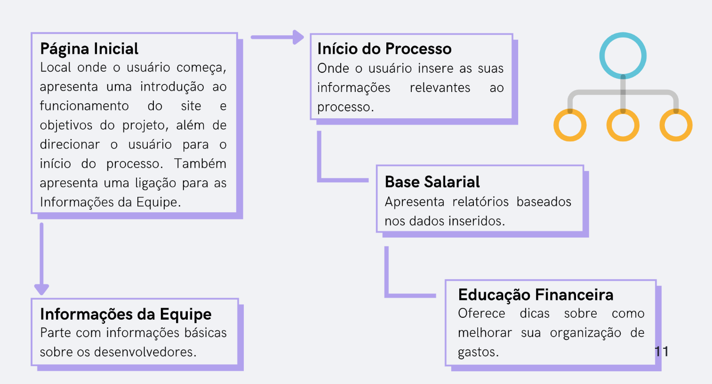

# Projeto de Interface

Para atender as dores de nossos usuarios, a plataforma visa direciona-los com conselhos e conteúdos para melhor controle financeiro de seus usuarios.

>A divisão das páginas foi feita da seguinte forma:
>Página Inicial: Local onde o usuário começa, apresenta uma introdução ao funcionamento do site e objetivos do projeto, além de direcionar o usuário para o início do processo. Também apresenta uma ligação para as Informações da Equipe.
>Início do Processo: Onde o usuário insere as suas informações relevantes ao processo.
>Base Salarial: Apresenta relatórios baseados nos dados inseridos.
>Educação Financeira: Oferece dicas sobre como melhorar sua organização de gastos.
>Informações da Equipe: Parte com informações básicas sobre os desenvolvedores.

## User Flow

## Wireframes

O wireframe do projeto foi desenvolvido pelo Figma, e pode ser visualizado pelo seguinte link: https://www.figma.com/file/YQ7W0SSBRzmP8uOKMXp2ja/Wireframing-in-Figma?node-id=0%3A445
