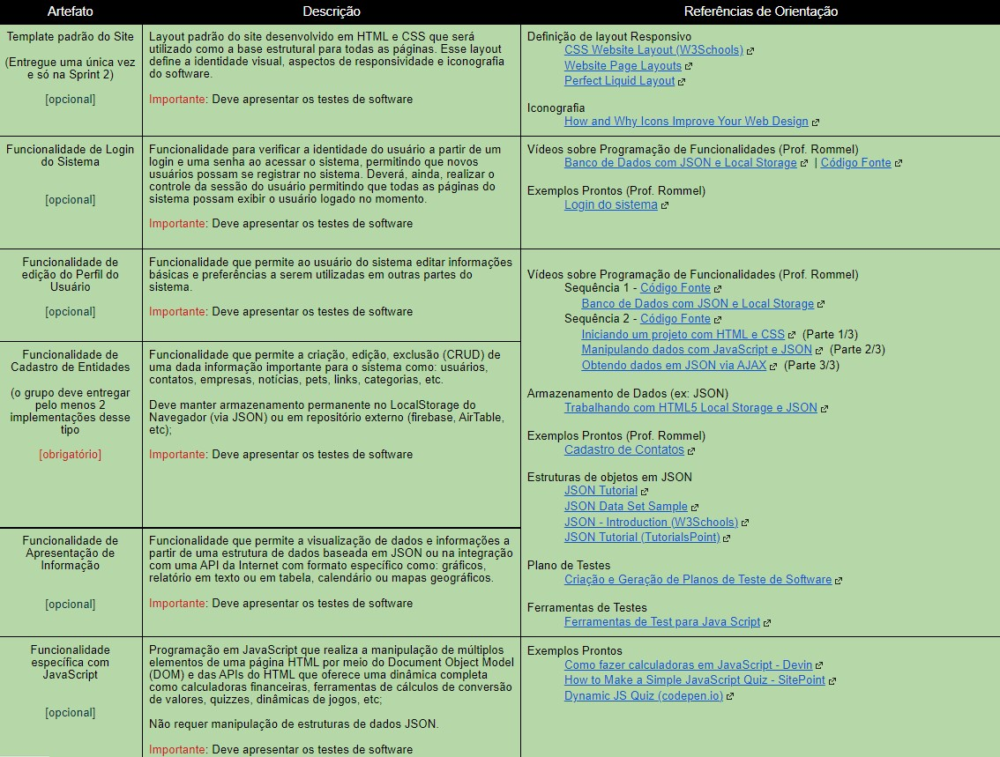

# Gerenciamento de Projeto
 
Para a realização do projeto, e solução do problema, o grupo todas as terça se reúnem via a plataforma do Teams com seus orientadores, para receber direcionamentos quanto ao desenvolvimento do projeto. Com a devida atenção, o grupo organiza reuniões que geralmente são feitas nas terça e nas quintas, caso haja pendências, ambas sendo feitas por volta das 14 horas, mas podendo ter flexibilidade quanto ao horário, para todos os membros participarem de forma ativa no projeto.
 
## Divisão de Papéis
 
Para a divisão da entrega do trabalho Sprint 1, toda a equipe se reuniu no Teams com duas reuniões semanais, iniciamos com a criação de documentação do conteúdo inicial que será utilizado durante todo o processo, dentre eles está incluso a criação da matriz CSD , mapa de stakeholders.
 
Nas semanas seguintes demos progresso na continuação do processo, começamos com a criação de Personas, mapa de empatia, organização de documentação, contexto de projeto e criação do GitHub.
 
Na sexta semana dividimos o grupo em duas partes, onde os seguintes membros ficaram responsáveis pela apresentação e criação do wireframe:
 
>1- Bruno Mello(wireframe)
>2- Dã (wireframe)
>3- Daniel (apresentação)
>4- Eduardo (apresentação)
 
Para o Sprint 2, mantivemos a mesma quantidade de reuniões, duas por semana, dispostas na terça e na quinta, sempre às 14:00 horas. Nesse sprint, deveríamos produzir alguns artefatos para o site, de critério essencial para o funcionamento do site. Seguindo as orientações dadas pela tabela abaixo:
 

 
Todos se organizaram individualmente para fazerem sua própria entrega, de acordo com os artefatos selecionados abaixo:
 
>1- Bruno Mello (Artefato de Template)
>2- Dã (Cadastro de Entradas e Saídas)
>3- Daniel (Funcionalidade JavaScript - Bloqueio de informações mediante a falta de login)
>4- Eduardo (Funcionalidade de Login do Sistema)
 
Para o Sprint 3, foi utilizado o mesmo plano de organização do Sprint 2. Duas reuniões por semana, e organização individual mediante as próprias pendências. As entregas dos artefatos dessa Sprint são compartilhadas com os artefatos para escolha do sprint 2, sendo os seguintes selecionados:
 
>1- Bruno Mello (Funcionalidade JavaScript - Alteração de conteúdo recomendado mediante a mudança de alguma opção)
>2- Dã (Funcionalidade de edição do Perfil do Usuário)
>3- Daniel (Funcionalidade JavaScript - Bloqueio de envio de formulário, mediante a dados invalidos)
>4- Eduardo (Funcionalidade de Apresentação de Informação - Gráficos)
 
Já o Sprint 4, foi uma tarefa a qual deveríamos juntar os artefatos produzidos para gerar o primeiro modelo prototipo do site. Essa tarefa exigiu grande trabalho em equipe, e comprometimento de todos os membros. Para facilitar o processo, o grupo foi dividido em funções. Além da entrega do protótipo, ainda seria necessário gravar, editar e postar um vídeo, e montar uma apresentação além de apresentá-la.
 
Devido a grande demanda o grupo foi dividido em responsabilidade quanto às entregas, de forma estratégica e inteligente considerando as habilidades de cada indivíduo presente. Abaixo as responsabilidades de cada membro.
 
>1- Bruno Mello (Juntar artefatos no protótipo final, editar/postar o vídeo de apresentação e auxiliar na atualização de documentos)
>2- Dã (Preencher conteúdos placeholder do site com conteúdo derradeiro e auxiliar a juntar artefatos no protótipo final)
>3- Daniel (Atualizar o Github, preparar/apresentar o powerpoint do projeto, marcar as reuniões, revisar o código e gravar o vídeo de apresentação)
>4- Eduardo (Juntar artefatos no protótipo final)
 
## Processo
 
Para organização e distribuição das tarefas do projeto, a equipe está utilizando o metodo Kanban pela plataforma [Trello](https://trello.com/b/DtywqWHa/quadro-de-controle-de-tarefas) estruturado com as seguintes listas:
 
>Recursos: esta lista mantém um template de tarefas recorrentes com as configurações padronizadas que todos devem seguir. O objetivo é permitir a cópia destes templates para agilizar a criação de novos cartões.
>Backlog: recebe as tarefas a serem trabalhadas e representa o Product Backlog. Todas as atividades identificadas no decorrer do projeto também devem ser incorporadas a esta lista.
>
>To Do: Esta lista representa o Sprint Backlog. Este é o Sprint atual que estamos trabalhando.
>
>Doing: Quando uma tarefa tiver sido iniciada, ela é movida para cá.
>
>Test: Checagem de Qualidade. Quando as tarefas são concluídas, eles são movidos para o “CQ”. No final da semana, eu revejo essa lista para garantir que tudo saiu perfeito.
>
>Done: nesta lista são colocadas as tarefas que passaram pelos testes e controle de qualidade e estão prontos para serem entregues ao usuário. Não há mais edições ou revisões necessárias, ele está agendado e pronto para a ação.
>
>Locked: Quando alguma coisa impede a conclusão da tarefa, ela é movida para esta lista juntamente com um comentário sobre o que está travando a tarefa.
 
## Ferramentas
 
As ferramentas empregadas no projeto são:
 
|Ambiente            | Plataforma                         | Link de Acesso                 |
|--------------------|------------------------------------|----------------------------------------|
| Repositório de código fonte: | GitHub | https://github.com/ICEI-PUC-Minas-PMGCC-TI/tiaw-pmg-cc-m-20212-consumo-excessivo |
| Projeto de interface e wireframes | Figma | https://www.figma.com/file/YQ7W0SSBRzmP8uOKMXp2ja/Wireframing-in-Figma?node-id=0%3A1 |
| Hospedagem | Repl.it | https://TIAWoniomania-consumo-excessivo.danielvaladares.repl.co |
| Documentos do Projeto | Google Drive | https://drive.google.com/drive/folders/1JPgkQexh0qMjiBkU21kAToDDk0UmDimA?usp=sharing |
| Gerenciamento do Projeto  | Trello | https://trello.com/b/DtywqWHa/quadro-de-controle-de-tarefas |