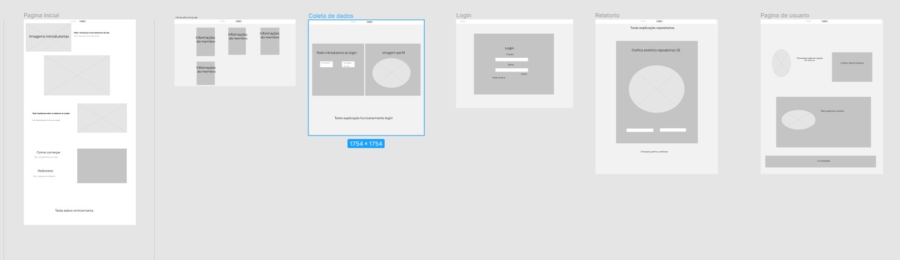

# Projeto da Solução
 
Nesse documento será exposto todas as tecnologias utilizadas, juntamente com a arquitetura de solução proposta pelo projeto. Tendo em mente mostrar as ferramentas utilizadas para produção e o fluxo de usuário em nossa solução.
 
## Tecnologias Utilizadas
 
Nesse projeto, diversas tecnologias foram utilizadas para criar o protótipo do projeto. Para montar o site foram usadas as tecnologias de html e css, juntamente com a linguagem de programação JavaScript. Para auxiliar no dinamismo de produção, juntamente com a implementação de uma responsividade no site, foi utilizado o framework do [Bootstrap v5.1.3](https://getbootstrap.com). Quanto à hospedagem do site, foi utilizada a plataforma do [Repl.it](https://replit.com/~). Completando assim, os elementos utilizados diretamente na produção da aplicação.
 
Para montagem do planejamento e dos artefatos, wireframes, fluxos do site e organização/monitoramento do projeto, outras plataformas foram utilizadas. Para criar os artefatos de design thinking, foi utilizado a plataforma de quadro compartilhado do [Miro](https://miro.com/signup/); para programação, foi utilizada a aplicação do [VScode](https://code.visualstudio.com) e a plataforma web do [Repl.it](https://replit.com/~); além disso para a produção do wireframe, utilizamos a plataforma do [Figma](https://www.figma.com) (abaixo um exemplo do wireframe produzido usando a plataforma Figma); e por último, a plataforma do [Github](https://github.com), que foi utilizada para manter a organização do projeto, juntamente ao quadro Kanban do [Trello](https://trello.com). Concluindo assim, as tecnologias utilizadas para produção do projeto.
 

 
## Arquitetura da solução
 
A imagem abaixo mostra o processo de fluxo do usuário para chegar na solução visada pelo site:
 

 
Os processos do usuário são indicados pelas setas numeradas. Abaixo a explicação de cada processo:
 
>1 - Primeiramente o usuário se depara com a pagina inicial, e por meio de seu cabeçario ele pode acessar a opção de Login;
>2 - Segundamente, na pagina de login o usuário precisa efetuar o login, caso possua, caso não ele por se registrar na mesma pagina de login, e depois efetuar o login.
>3 - Terceiramente, com o login efetuado, o usuário é redirecionado para a pagina de perfil, onde ele pode clicar na opção de relatorios onde novamente sera redirecionado.
>4 - Ultimamente, na pagina de relatorios, o usuário recebe as respostas mediantes aos dados que inserir.